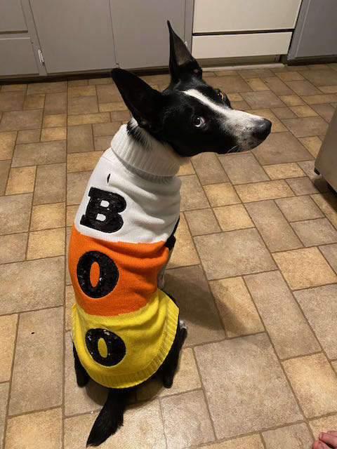

## Introduction

Hello, and welcome to my website/blog. I am hoping to write and upload a blog post once every week or two. We'll see how it goes... but here's to hoping it keeps me on track with my research!

You can find a little bit more information about me on the [About](https://jkleinkopf.com/about.html) page, and a little bit more about my research on the [Research](https://jkleinkopf.com/research.html) page. Once the lab gets going, I will be writing a little bit more about the work I do (both wet lab work, and field work) here on this page. I might also post an analysis or two, or general thoughts on the state of sciences and museums.

In the meantime, here is a picture of my dog Charlie getting ready for spooky season. She's a year and a half (as of September 2021) and still has the energy of a puppy. I don't love candy corn but I will make an exception this one time ;). 


```{r, fig.align="center", out.width='400px', echo=FALSE, preview=TRUE}

```


