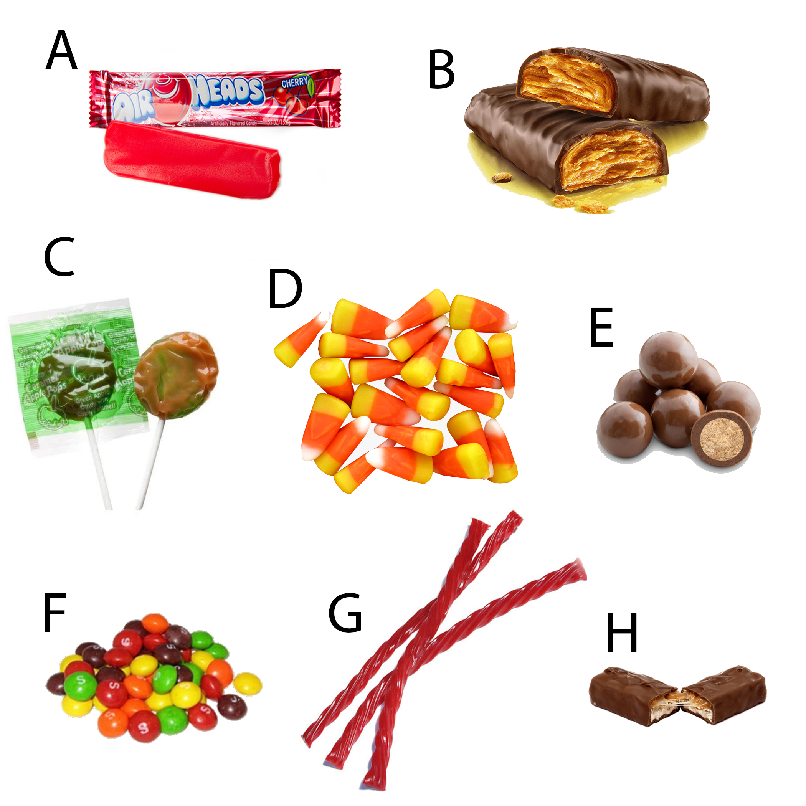

```{r setup, include=FALSE}
knitr::opts_chunk$set(echo = FALSE)
```

```{r}

```


## Introduction

Have you ever wondered how Halloween candies are related to each other? Me neither! But let's try to figure it out anyways using morphological data and phylogenetic tools. 

We went through a couple of iterations of this idea before finally settling on the idea presented here. We previously considered building a phylogeny based on Halloween animals (there aren't many Halloween animals) and foods (also not many Halloween foods), but there are a lot of Halloween candies! Why not build a phylogeny of candies, based on morphological traits? 

Of course, candy is man-made and so we can't really build a phylogeny for candy, but for this project, I am going to make a few assumptions:

1. All candy share a common ancestor.
2. Candy and fruit share a closely related common ancestor, so we can root our tree using fruit (Apples) as an outgroup. 
3. Morphology can be used to infer relationships between candies.  

## Methods

### Sampling
To construct a phylogeny of Halloween candies, 46 popular candies were selected (with the help of office colleagues). We started with a list of best and worst candies from the internet^[https://www.delish.com/food/a37827339/best-and-worst-halloween-candy/] and removed “candies” that are not actually candies (pretzels should never be given out on Halloween), and expanded our list to include candy that we had received on Halloween in our own childhoods. We also included the Apple in our dataset to serve as the outgroup. The apple was perhaps the original candy, providing people with a sweet treat prior to the advent of cane sugar in manufactured sweets, and as such, is useful as a comparison for the rest of our candies.

```{r, fig.cap="A plate representing the diversity of Halloween candy we evaluated in our assessment of relatedness. We included candies from across the American candy sphere. A. Airheads; B. Butterfinger; C. Caramel Apple Pops; D. Candy Corn; E. Whoppers; F. Skittles; G. Twizzlers; H. Snickers."}

```

### Characters
We evaluated each candy and our outgroup sample for the “Shape” character (seven possible character states) and for 21 presence-absence characters. For the “Peanuts” character, we considered both whole peanuts and peanut butter to have peanuts. To distinguish between these, the character “Crunchy” is present for candies with whole peanuts, and absent for those with peanut butter only. A table of candies and their traits and descriptions is provided below. 


### Phylogeny
To construct our morphology-based phylogeny, we imported our character data-frame .csv file into Mesquite^[Maddison, W. P. and D.R. Maddison. 2021. Mesquite: a modular system for evolutionary analysis.  Version 3.70  http://www.mesquiteproject.org]. A phylogeny for our dataset was constructed using the Treelength criterion for tree search, which calculates the parsimony treelength of a given tree and matrix. Subtree pruning and regrafting was used for tree rearrangement and Maxtrees was set to 100. Trees were re-rooted using Apple as the outgroup, and a majority-rule consensus tree with a threshold of 0.5 was constructed from the 100 most parsimonious tree replicates.

The treefile was imported into ggTree^[G Yu, DK Smith, H Zhu, Y Guan, TTY Lam*. ggtree: an R package for visualization and annotation of phylogenetic trees with their covariates and other associated data. Methods in Ecology and Evolution. 2017, 8(1):28-36. doi: 10.1111/2041-210X.12628] for visualization. While it be ideal to leave Apple in our phylogeny, we had some difficulties visualizing the phylogeny without a polytomy forming at the base of the tree, so we pruned Apple out of the phylogeny all together. The tree itself, however, should be assumed to be rooted.

## Results & Discussion

### Characters
After assigning character values for each candy, six characters were parsimony uninformative (Toffee, Wafer, Mint, Biscuit, Malt, and Mousse). The rest were of the characters were informative (see table below). In retrospect, we could have added more characters and removed parsimony uninformative characters from the matrix, but... for the fun of it, we kept them in the matrix.

<iframe src="https://docs.google.com/spreadsheets/d/e/2PACX-1vQ4HyQqTnbOzqnv2xWDluFX91mS5X8s98JPb6XsjBsqItfoT9cUhTCEWNlsY_Pdfaivpjsc6zVo2VbR/pubhtml?gid=0&amp;single=true&amp;widget=true&amp;headers=false" height="300"></iframe>


### Phylogeny

Our phylogeny contains interesting clades that have been highlighted in the phylogeny below in orange, red, and purple. The clade highlighted in purple is a clade we've called "Classic Candies" and includes a clade of Lollipops (DumDumPops, TootsiePops, BlowPops and CaramelApplePops), a clade that I'll informally call the "Oldies" (WerthersOriginals, CandyCorn, Rolos), and a few other candies with some similarities (Warheads, JollyRanchers, and Gobstoppers). 

```{r, fig.height=8, preview=TRUE, fig.cap = "Majority rule consensus tree of 100 most parsimonious trees based on morphological candy data. Three clades of interest are highlighted: Red: 'Peanuty' clade; Orange: 'Segmented' clade; Purple: 'Classic Candies' clade"}
library(treeio)
library(ggtree)

# read tree file and root with outgroup "Apple"
tree <- read.tree(file = "CandyConsensusTree.phy")
rooted <- root(tree, outgroup = "Apple")
p1 <- ggtree(rooted, ladderize = TRUE) + geom_tiplab(size = 3) + ggplot2::xlim(0, 10)
#p1

# delete outgroup to make visually more pleasing...
reduced <- drop.tip(rooted, "Apple")
p2 <- ggtree(reduced) + geom_tiplab(size = 3) + ggplot2::xlim(0, 38)

# view nodes
nodes <- reduced %>% as.treedata %>% as_tibble
# print(nodes, n=50)

# add label to node 50 and highlight the clade
tree <- p2 + 
  geom_hilight(node=50, fill='orange', type="rect", alpha=0.6) + geom_cladelab(node = 50, fontsize=4, barsize=1.5, label= "Segmented", align=TRUE, barcolor='orange', offset=5, offset.text=.5, hjust='center', angle=90) +
  geom_hilight(node=55, fill='orangered2', type="rect", alpha=0.6) + geom_cladelab(node = 55, fontsize=4, barsize=1.5, hjust='center', angle=90, label= "Peanuty", align=TRUE, barcolor='orangered2', offset=5, offset.text=.5) +
  geom_hilight(node=83, fill='purple2', type="rect", alpha=0.6) + geom_cladelab(node = 83, fontsize=4, barsize=1.5, hjust='center', angle=90, label= "Classic Candies", align=TRUE, barcolor='purple2', offset=7, offset.text=.5)

print(tree)
```

I love that these "Classic Candies" branch off from the rest of the candy group early in the phylogeny, indicating they share more ancestral traits similar to those of Apples and other candies that branch off even earlier (Nerds, Smarties, and Runts). Along those lines, it is funny that Runts branch off from the rest of the candies first, because their shapes resemble those of fruits (unintended)! 

Another interesting clade is the "Segmented" clade (HersheysBar, KitKat, MrGoodbar, NestleCrunch). Segmented was also a character, but because they also have other character traits that are not necessarily common among these candies and which are present in other candies, I was not necessarily expecting them to group together.

The other interesting clade, "Peanuty" (Whoppers, M&Ms, ReesesPieces, Reeses, Butterfinger) caught my eye simply because this might be the tastiest (in my opinion) clade of the bunch. While Whoppers and M&Ms don't necessarily have peanuts, their similarity in shape to ReesesPieces is probably what caused these five candies to group together.

### Conclusions

I had a lot of fun building this phylogeny, even if it really has no basis in anything real. It was my first time building a morphological trait matrix and my first time using ggTree to build phylogenies. This idea was based on a couple of just-for-fun phylogenies I have seen built around silly things (for example, bag ties^[https://phylonetworks.blogspot.com/2014/10/the-phylogeny-of-plastic-bag-ties.html]). I hope you enjoyed and if you have any thoughts/ideas/suggestions/critiques (anything I need to fix?) please send me an email! Happy Halloween!


