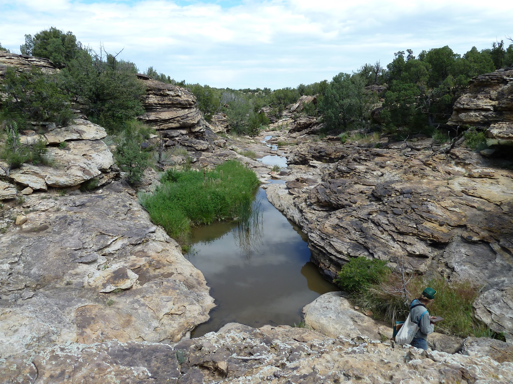

```{r setup, include=FALSE}
knitr::opts_chunk$set(echo = FALSE)
```

### Background

The Purgatory Watershed in southeastern Colorado and northeastern New Mexico is a region composed of deep canyons, eroded mesas, and extensive intact shortgrass plains, and is located at the crossroads of biodiversity of the Rocky Mountains, Great Plains, and Chihuahuan Desert. Despite a lack of biological research in the area, it is home to a number of unique land formations (see figure 2) and endemic organisms. Prompted by herbarium and field observations of morphologically aberrant forms of a number of plant species from this region, we conducted a study comparing morphometric and genetic data of plant populations from within the Purgatory to populations of those same species found outside of the Purgatory.

### Study and Results

The two species of plant we looked at were _Amorpha nana_, a perennial shrub found in prairies and hillsides across midwestern North America, and _Tetraneuris acaulis_, a perennial herb found in open, dry hillsides and plains across western North America. However, in the Purgatory, there are morphologically aberrant populations of these plants. We collected morphometric and genetic data from a number of individuals across the ranges of each species, and compared those data to the morphometric and genetic data from individuals of Purgatory populations. We found no difference between Purgatory and non-Purgatory populations of _Tetraneuris acaulis_, but there were clear differences (both morphologically and genetically) between the Purgatory and non-Purgatory populations of _Amorpha nana_. While this study alone is insufficient for making claims that the Purgatory is a region of neo-endemism, the lack of research on the area makes the Purgatory a compelling location of interest for future biodiversity studies.

```{r Purgatory, width='100%', fig.cap = "A drainage of the Purgatory River. At the crossroads of the Rocky Mountains, Great Plains, and Chihuahuan Desert, the Purgatory Watershed hosts an eclectic mix of organisms.", echo=FALSE}

```

### Publications

Kleinkopf, J.A., D.A. Clark, and E.A. Tripp. 2017. _Aberrant Plant Diversity in the Purgatory Watershed of Southeastern Colorado and Northeastern New Mexico._ Western North American Naturalist. 77(3). DOI: 10.3398/064.077.0307 [(PDF)](files/Kleinkopf_etal_2017.pdf)